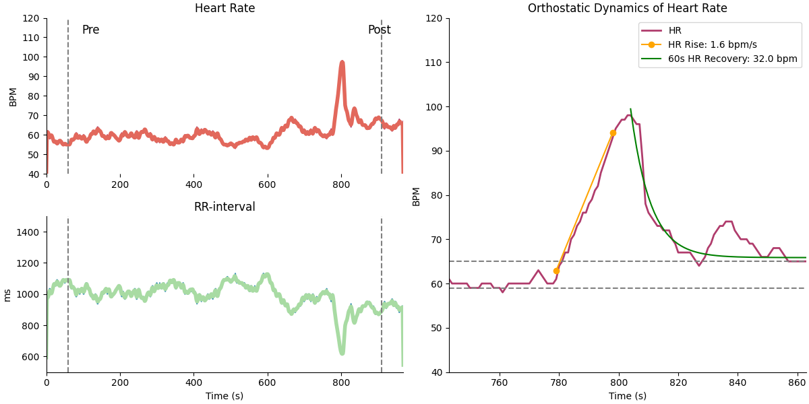
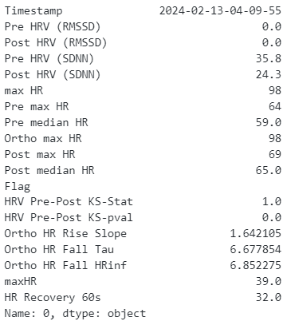
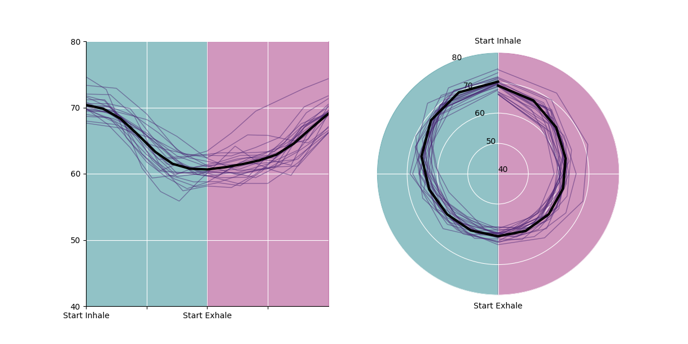

# trackfitness
scripts and tools to parse and visualize body fitness data from various sources

Dependencies:
import numpy as np
import matplotlib.pyplot as plt
import seaborn as sns
import pandas as pd
from pathlib import Path
import fitparse
import orthostatic_delta_hrv_test as odht
%matplotlib widget

# Usage:
Orthostatic load refers to the physiological stress experienced by the body when transitioning from a supine or seated position to an upright position. This change in posture can lead to alterations in blood pressure, heart rate, and other cardiovascular parameters. Orthostatic load is commonly used as a measure of autonomic nervous system function and cardiovascular health.

Heart Rate Variability (HRV) is a measure of the variation in time intervals between consecutive heartbeats. It reflects the dynamic balance between sympathetic and parasympathetic branches of the autonomic nervous system, which regulate heart rate. HRV is considered an indicator of autonomic nervous system activity and can provide insights into the body's ability to adapt to various physiological and psychological stressors.

For more information, you can refer to the following Wikipedia articles:

- [Orthostatic load](https://en.wikipedia.org/wiki/Orthostatic_load)
- [Heart Rate Variability (HRV)](https://en.wikipedia.org/wiki/Heart_rate_variability)
- Marco Altini's fantastic [HRV4Training](https://www.hrv4training.com/) website and [blog posts](https://marcoaltini.substack.com/)


### How to measure?
For atheletes, it is recommended to measure the HRV and Orthostatic Load every morning after waking up and in a sitting position.

The first state of orthostatic load measurement also takes care of HRV measurement.

Use Polar Sensor Logger to record the data.

*Steps*:
1. Measure immediately after waking up and using the toilet.
2. Sit comfotably on a chair, with or without back support. Use the same settings every day.
3. Relax and breathe normally for 1 minute before starting the measurement.
4. Start the measurement and remain seated for 5 minutes.
5. Stand up after 5 minutes and remain standing for 3 minutes.
6. Stop the measurement after 3 minutes of standing.
7. Export the file to the directory.
8. Run the code to get the results.

_Important_: Do not cross your legs and do not talk or move during the measurement.

_Important_: Breathe normally and do not hold your breath during the measurement.

Example of the data file:
```python
import importlib
import numpy as np
import matplotlib.pyplot as plt
import seaborn as sns
import pandas as pd
from pathlib import Path
import fitparse
import orthostatic_delta_hrv_test as odht

filepath = Path(r"C:\Users\adity\OneDrive\Gnosis\Codes\trackfitness\98319-88283754.fit") #"C:\Users\adity\OneDrive\Gnosis\Codes\trackfitness\98319-Activity_2024-02-13_09-39_88283754.tcx")
origins = ['Polar Sensor Logger Export', 'Runalyze Fit Export' , 'Runalyze TCX Export']
origin = origins[1]

pre_baseline_period = 240 # seconds
post_baseline_period = 120 # seconds

# import orthostatic_delta_hrv_test as odht
df, params, [fig, ax] = odht.main(filepath, origin, pre_baseline_period=pre_baseline_period, post_baseline_period=post_baseline_period, plot=True) #, plot=True)
```

## Results
The results are displayed in the form of a plot. The plot shows the HRV and Orthostatic Load over the period of time. The HRV is measured in milliseconds and the Orthostatic Load is measured in beats per minute.

### Orthostatic HRV Test


### Orthostatic Load and other parameters


### Breathing Quality

